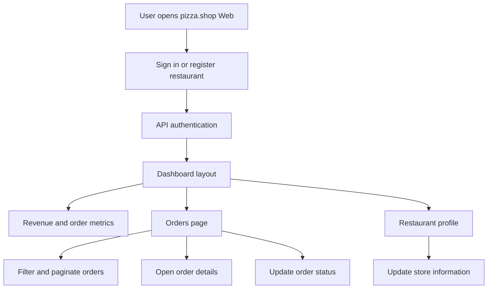
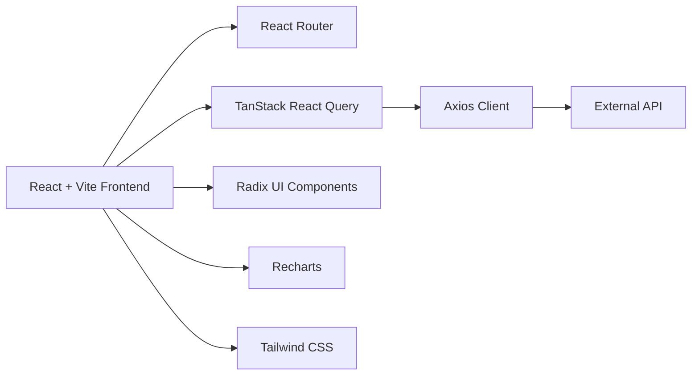

# 🍕 pizza.shop Web

<h3 align="center">
  A restaurant management dashboard built with React, Vite, TypeScript and modern frontend tooling.
</h3>

<p align="center">
  <strong>Orders · Revenue metrics · Popular products · Restaurant profile · Authentication · Dashboard UI</strong>
</p>

<p align="center">
  
  
  
  
  
  
</p>

---

## 📌 About the Project

**pizza.shop Web** is a frontend dashboard for restaurant partners to monitor sales, manage orders, view revenue metrics and update restaurant profile information.

The application was built with a modern React stack and focuses on the experience of a restaurant manager: authentication, dashboard indicators, revenue charts, order filtering, order details, status changes and profile management.

### 🇧🇷 Descrição em Português

O **pizza.shop Web** é um painel administrativo para restaurantes acompanharem pedidos, métricas de faturamento, produtos populares, status de entrega e informações do estabelecimento em uma interface moderna construída com React, Vite e TypeScript.

---

## ✨ Features

### Authentication

- Sign in with e-mail
- Restaurant registration flow
- Automatic redirect to login when the API returns unauthorized access
- Sign out flow
- Toast notifications for feedback

### Dashboard

- Monthly revenue card
- Monthly orders card
- Daily orders card
- Monthly canceled orders card
- Revenue chart by selected period
- Popular products pie chart
- Loading skeletons for metrics and charts

### Orders

- Paginated order table
- Filter orders by:
  - order ID
  - customer name
  - status
- Order details modal
- Customer information
- Order items list
- Order total
- Order status badges
- Status transition actions:
  - approve order
  - dispatch order
  - mark as delivered
  - cancel order

### Restaurant Profile

- Managed restaurant dropdown
- Restaurant profile dialog
- Update restaurant name
- Update restaurant description
- Optimistic cache update with rollback on error

### UI / UX

- Dark mode by default
- Theme toggle
- Responsive dashboard layout
- Toast notifications
- Skeleton loading states
- Reusable UI components
- Radix UI primitives
- Lucide icons

---

## 🧠 How It Works



---

## 🏗️ Architecture



The frontend consumes an external API configured through the `VITE_API_URL` environment variable. Axios is configured with `withCredentials: true`, allowing the app to work with cookie-based authentication.

---

## 🛠️ Tech Stack

### Core

| Technology | Usage |
|---|---|
| React 19 | UI rendering |
| Vite 6 | Development server and build tool |
| TypeScript | Type safety |
| React Router DOM 7 | Client-side routing |
| TanStack React Query 5 | Server state, caching and mutations |
| Axios | HTTP client |
| Zod | Environment and form validation |
| React Hook Form | Form handling |
| Tailwind CSS 4 | Styling |
| Recharts | Dashboard charts |
| Radix UI | Accessible UI primitives |
| Lucide React | Icon library |
| Sonner | Toast notifications |

### Tooling

| Tool | Usage |
|---|---|
| ESLint | Code linting |
| Rocketseat ESLint Config | Shared linting rules |
| Prettier | Code formatting |
| Prettier Plugin Tailwind CSS | Tailwind class sorting |
| TypeScript ESLint | TypeScript linting |
| Vite React Plugin | React integration with Vite |

---

## 📁 Project Structure

```bash
pizzashop-web/
├── src/
│   ├── api/
│   │   ├── approve-order.ts
│   │   ├── cancel-order.ts
│   │   ├── deliver-order.ts
│   │   ├── dispatch-order.ts
│   │   ├── get-daily-revenue-in-period.ts
│   │   ├── get-managed-restaurant.ts
│   │   ├── get-month-orders-amount.ts
│   │   ├── get-month-revenue.ts
│   │   ├── get-order-details.ts
│   │   ├── get-orders.ts
│   │   ├── get-popular-products.ts
│   │   ├── get-profile.ts
│   │   ├── register-restaurant.ts
│   │   ├── sign-in.ts
│   │   └── sign-out.ts
│   ├── components/
│   │   ├── ui/
│   │   ├── account-menu.tsx
│   │   ├── header.tsx
│   │   ├── nav-link.tsx
│   │   ├── order-status.tsx
│   │   ├── pagination.tsx
│   │   └── store-profile-dialog.tsx
│   ├── lib/
│   │   ├── axios.ts
│   │   └── react-query.ts
│   ├── pages/
│   │   ├── _layouts/
│   │   ├── app/
│   │   │   ├── dashboard/
│   │   │   └── orders/
│   │   ├── auth/
│   │   ├── 404.tsx
│   │   └── error.tsx
│   ├── app.tsx
│   ├── env.ts
│   ├── global.css
│   ├── main.tsx
│   └── routes.tsx
├── package.json
├── vite.config.ts
└── README.md
```

---

## 📄 Main Files

| File | Description |
|---|---|
| `src/main.tsx` | React application entry point |
| `src/app.tsx` | Root providers: theme, toaster, React Query and router |
| `src/routes.tsx` | Application routes |
| `src/lib/axios.ts` | Axios client configured with API base URL and credentials |
| `src/env.ts` | Environment variable validation with Zod |
| `src/pages/app/dashboard/dashboard.tsx` | Main dashboard page |
| `src/pages/app/orders/orders.tsx` | Orders table, filters and pagination |
| `src/pages/auth/sign-in.tsx` | Sign-in form |
| `src/pages/auth/sign-up.tsx` | Restaurant registration form |
| `src/components/account-menu.tsx` | Account dropdown, profile access and sign out |
| `src/components/store-profile-dialog.tsx` | Restaurant profile update dialog |

---

## ⚙️ Requirements

- Node.js 20+
- npm
- Running backend/API compatible with the pizza.shop endpoints
- Environment variables configured

---

## ▶️ Running Locally

Install dependencies:

```bash
npm install
```

Create a local environment file:

```bash
cp .env.example .env.local
```

If `.env.example` does not exist yet, create `.env.local` manually using the variables below.

Start the development server:

```bash
npm run dev
```

Open:

```bash
http://localhost:5173
```

---

## 🔐 Environment Variables

Create `.env.local` with:

```bash
VITE_API_URL=http://localhost:3333
VITE_ENABLE_API_DELAY=false
```

| Variable | Description |
|---|---|
| `VITE_API_URL` | Base URL of the backend API |
| `VITE_ENABLE_API_DELAY` | Enables a random artificial delay in API requests for loading-state testing |

---

## 🧪 Available Scripts

```bash
npm run dev
```

Starts the Vite development server.

```bash
npm run build
```

Runs TypeScript build checks and generates the production build.

```bash
npm run preview
```

Serves the production build locally.

```bash
npm run lint
```

Runs ESLint on the project.

```bash
npm run lint-fix
```

Runs ESLint and automatically fixes supported issues.

```bash
npm run format
```

Checks code formatting with Prettier.

```bash
npm run format-fix
```

Formats the codebase with Prettier.

---

## 🧭 Routes

| Route | Description |
|---|---|
| `/` | Dashboard with metrics and charts |
| `/orders` | Orders table with filters, pagination and actions |
| `/sign-in` | Authentication page |
| `/sign-up` | Restaurant registration page |
| `*` | Not found page |

---

## 🔌 API Integration

The application expects a backend API with endpoints for:

### Authentication

- `POST /authenticate`
- `POST /sign-out`
- `POST /restaurants`

### Profile / Restaurant

- `GET /me`
- `GET /managed-restaurant`
- `PUT /profile`

### Metrics

- `GET /metrics/month-revenue`
- `GET /metrics/month-orders-amount`
- `GET /metrics/day-orders-amount`
- `GET /metrics/month-canceled-orders-amount`
- `GET /metrics/daily-receipt-in-period`
- `GET /metrics/popular-products`

### Orders

- `GET /orders`
- `GET /orders/:orderId`
- `PATCH /orders/:orderId/approve`
- `PATCH /orders/:orderId/cancel`
- `PATCH /orders/:orderId/dispatch`
- `PATCH /orders/:orderId/deliver`

---

## 📊 Dashboard Metrics

The dashboard includes:

- Total monthly revenue
- Monthly order amount
- Daily order amount
- Monthly canceled orders
- Daily revenue line chart
- Popular products pie chart

---

## 🎨 UI Details

The UI uses a component-driven approach inspired by modern admin dashboards:

- reusable button, input, table, dialog, dropdown and select components
- dark theme support
- theme persistence with local storage
- loading skeletons
- accessible UI primitives from Radix
- icons from Lucide React
- charts from Recharts
- toast feedback with Sonner

---

## 🧪 QA Opportunities

This project is a good candidate for practicing frontend QA and test documentation.

Suggested test scenarios:

| Scenario | Expected Result |
|---|---|
| User submits a valid sign-in email | Success toast is displayed |
| API returns unauthorized | User is redirected to `/sign-in` |
| User filters orders by customer name | URL search params update and order list refetches |
| User changes order page | Pagination updates the `page` search param |
| User opens order details | Modal loads customer and order item information |
| User approves a pending order | Order status updates to `processing` |
| User dispatches a processing order | Order status updates to `delivering` |
| User marks an order as delivered | Order status updates to `delivered` |
| User cancels a pending order | Order status updates to `canceled` |
| User updates restaurant profile | UI updates optimistically and shows success toast |

---

## 🧭 Roadmap / Future Improvements

- [ ] Add real screenshots to this README
- [ ] Add a live demo link
- [ ] Add `.env.example`
- [ ] Add automated tests with Vitest
- [ ] Add component tests with React Testing Library
- [ ] Add E2E tests with Playwright
- [ ] Improve form validation messages in sign-up
- [ ] Remove temporary ESLint disable comments where possible
- [ ] Standardize code formatting and indentation
- [ ] Fix package name typo from `pizzashope-web` to `pizzashop-web`
- [ ] Add CI workflow for lint, format and build
- [ ] Add API contract documentation
- [ ] Add mock service worker for local development without backend
- [ ] Improve accessibility checks for dialogs, tables and charts
- [ ] Add error states for metrics and order list requests

---

## ⚠️ Notes

- This repository contains the frontend application only.
- A compatible backend API is required.
- Authentication depends on the API and cookie-based sessions.
- The Axios client uses `withCredentials: true`.
- Environment variables are validated with Zod.
- The project currently does not include automated tests.

---

## 💡 What I Learned

This project helped practice:

- building an admin dashboard with React and Vite
- organizing routes with React Router
- managing server state with TanStack React Query
- creating forms with React Hook Form and Zod
- consuming REST APIs with Axios
- working with tables, filters and pagination
- creating dashboard charts with Recharts
- using Radix UI primitives
- applying Tailwind CSS in a real interface
- handling optimistic UI updates
- documenting a frontend project for portfolio usage

---

## 👨‍💻 Author

Developed by **Yruam Käffer de Faria**.
